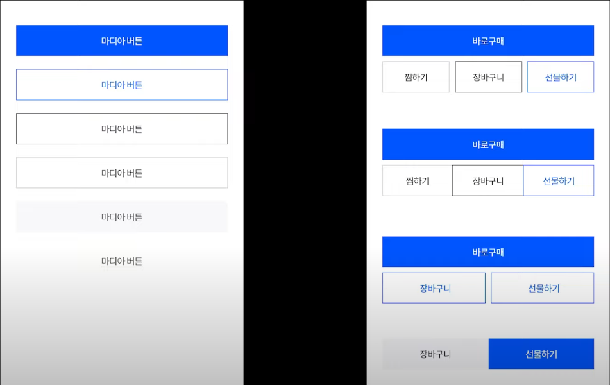
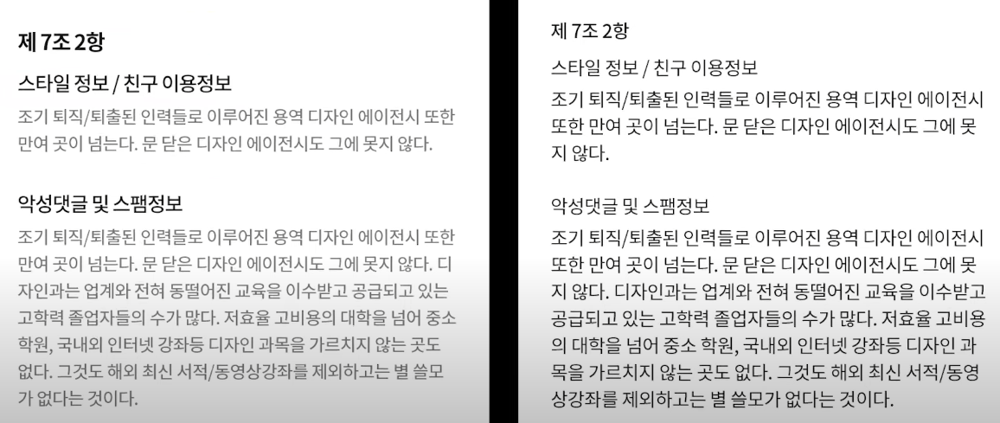

1. 폰트 사이즈는 1배수 12 2배수 24로 설정

   * 가독성이 중요하기 때문

2.  버튼을 클릭하는 손가락 두께를 고려해서 버튼간의 간격, 버튼 사이즈 설정하기

3.  아이콘은 통일감있게 스타일 맞춰주기

4.  폰트컬러는 접근성 4.5:1 컬러 이용(색 가독성 문제)

5.  통일감있는 스타일로 쭉 디자인

6. 버튼, 폰트의 계층구조(강약, 색깔, 크기)

   

7. 하단 네비게이션 아이콘은 누구나봐도 이해가능한 아이콘 사용. 5개이상은 사용하면 혼란이온다.
8. 컨텐츠간의 여백은 충분하게 주기
9. 컨텐츠간의 그룹 확실하게 구분(여백, 카드 UI)
10. 레이아웃은 잘게 쪼개는것 보다 큼직큼직한것이 낫다.    